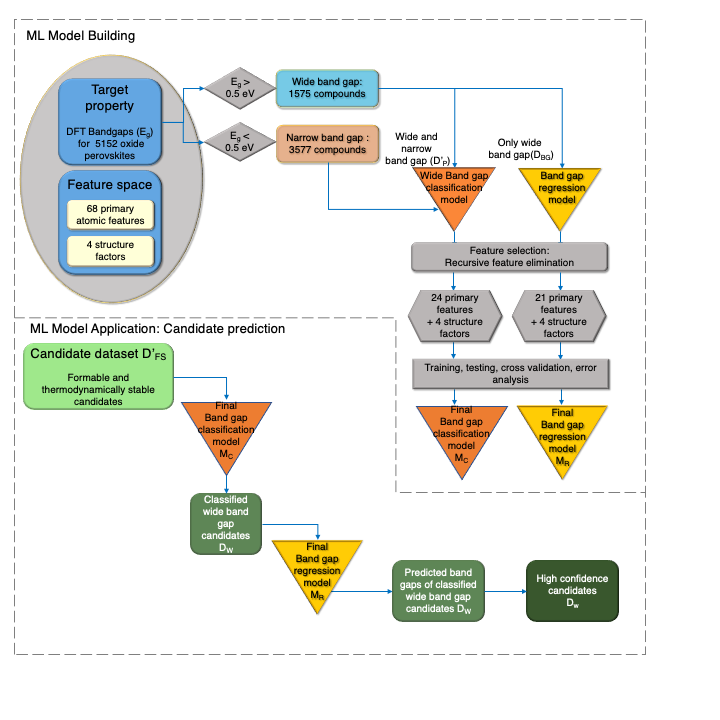

# A hierarchical ML-aided high-throughput screening framework for the discovery of novel oxide perovskites

This set of scripts implements a hierarchical Random Forest (RF)-based ML framework to efficiently screen a large chemically diverse domain for thermodynamically stable double oxide perovskites with wide band gaps. 

The framework implements three classification models (RFC) and one regressioon model (RFR): 

RFC1. RFC model to classify experimentally formable oxide perovskites 

RFC2. RFC model to classify thermodynamically stable oxide perovskites (Energy above hull threshold = 50 meV) 

RFC3. RFC model to classify oxide perovskites with wide band gap ( > 0.5 eV)

RFR1: RFR model to predict the band gap of double oxide perovskites

## Example code

The Jupyter notebook perovMLdis.ipynb demonstrates the implementation of RFC3 and RFR1 sequentially.

For more information on the methods used in this framework, please see our publications:

1.  Talapatra, A., Uberuaga, B. P., Stanek, C. R., & Pilania, G. (2021). A Machine Learning Approach for the Prediction of Formability and Thermodynamic Stability     of Single and Double Perovskite Oxides. Chemistry of Materials, 33(3), 845-858.
